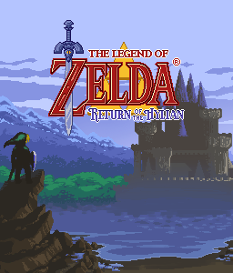

# Zelda Return of the Hylian (v. 7.8)

It's a Miyoo Mini Port and Russian translation of [**Zelda - Return of the Hylian**](http://www.zeldaroth.fr/), a short and pleasant fangame from Vincent Jouillat. The original game was developed in C++ and was released in 2006.

Based on Zelda ROTH 7.8 version.

The logo for the thumbnail image is based on data files from [Solarus Remake of Zelda Return of the Hylian](https://gitlab.com/solarus-games/games/zelda-roth-se) licensed under [Creative Commons Attribution-ShareAlike 4.0 (CC BY-SA 4.0)](http://creativecommons.org/licenses/by-sa/4.0/).
