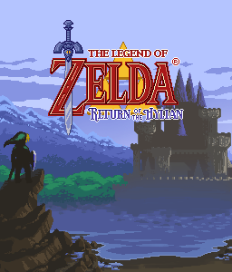

# Zelda Return of the Hylian (v. 7.8)



It's a Switch Port and Russian translation of [**Zelda - Return of the Hylian**](http://www.zeldaroth.fr/), a short and pleasant fangame from Vincent Jouillat. The original game was developed in C++ and was released in 2006.

Based on Zelda ROTH 7.8 version.

The logo for the thumbnail image is based on data files from [Solarus Remake of Zelda Return of the Hylian](https://gitlab.com/solarus-games/games/zelda-roth-se) licensed under [Creative Commons Attribution-ShareAlike 4.0 (CC BY-SA 4.0)](http://creativecommons.org/licenses/by-sa/4.0/).

## Build

### Step 1: Install Docker Desktop and Configure WSL2 Integration

1. Download Docker Desktop from the [official website](https://www.docker.com/products/docker-desktop/).
2. Run the installer and follow the prompts.
3. **Restart your computer** after installation.
4. Launch Docker Desktop and wait for the **"Docker Desktop is running"** icon in the system tray.
5. Open **Docker Desktop** → **Settings** (gear icon)
6. Navigate to **Resources** → **WSL integration**
7. Enable **"Enable integration with my default WSL distro"**
8. In the distribution list, make sure **Ubuntu** has the toggle enabled
9. Click **Apply & restart**

### Step 2: Install VS Code Extensions

1. Open VS Code
2. Press `Ctrl+Shift+X` to open the Extensions panel
3. Search for and install:
   - **Dev Containers**
   - **C/C++**
   - **Makefile Tools**

### Step 3: Open in Dev Container

1. Launch Visual Studio Code
2. Open the project folder: File → Open Folder → select ZeldaROTH-new-engine
3. When prompted in the bottom-right corner, click "Reopen in Container"
4. VS Code will pull the Docker image and set up the container (2–5 minutes on first run)

### Step 4. Build

1. Open the integrated terminal in VS Code and run:
```bash
#Clean previous build artifacts (recommended on first build)
make -f Makefile.switch clean

# Build with all CPU cores (fastest)
make -f Makefile.switch -j$(nproc)
```
## Installation

1. Connect the SD card to your computer
2. Create the folder `/switch/ZeldaROTH/` on the SD card (if it doesn't exist)
3. Copy ZeldaRotH_nx.nro into `/switch/ZeldaROTH/`
4. Copy the `data/` folder next to the NRO file
5. Safely eject the SD card and insert it into the console